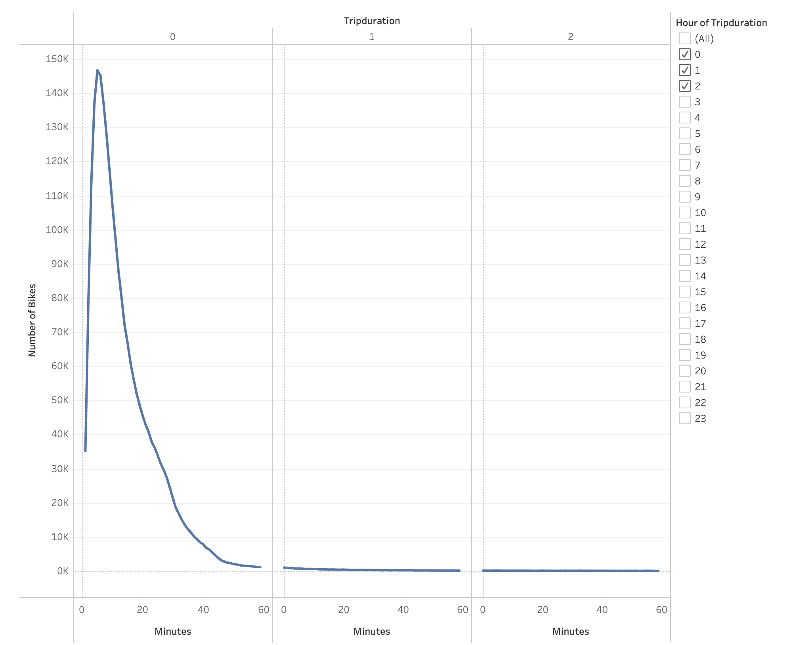
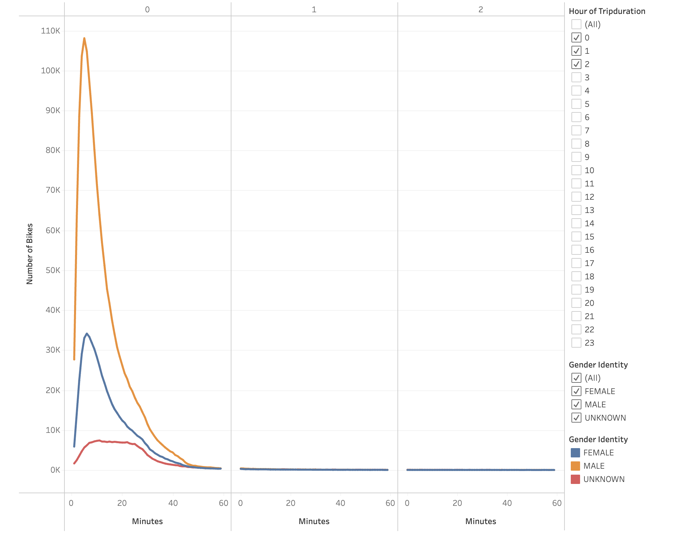
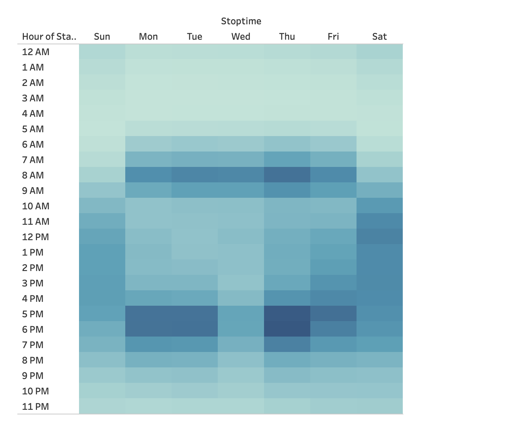
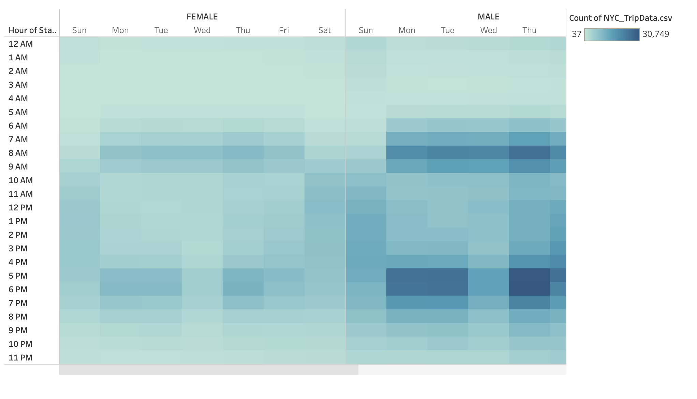
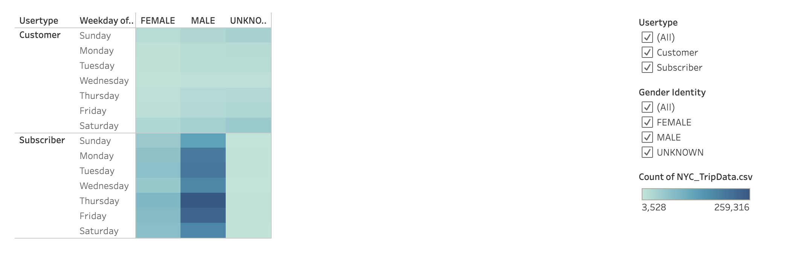
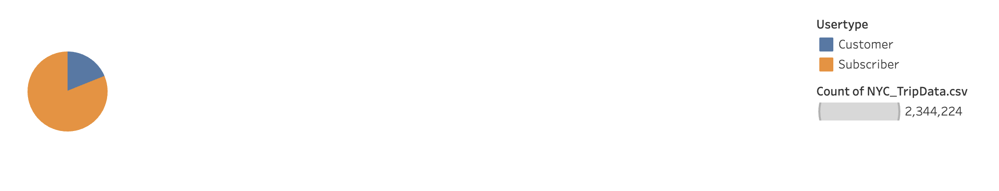
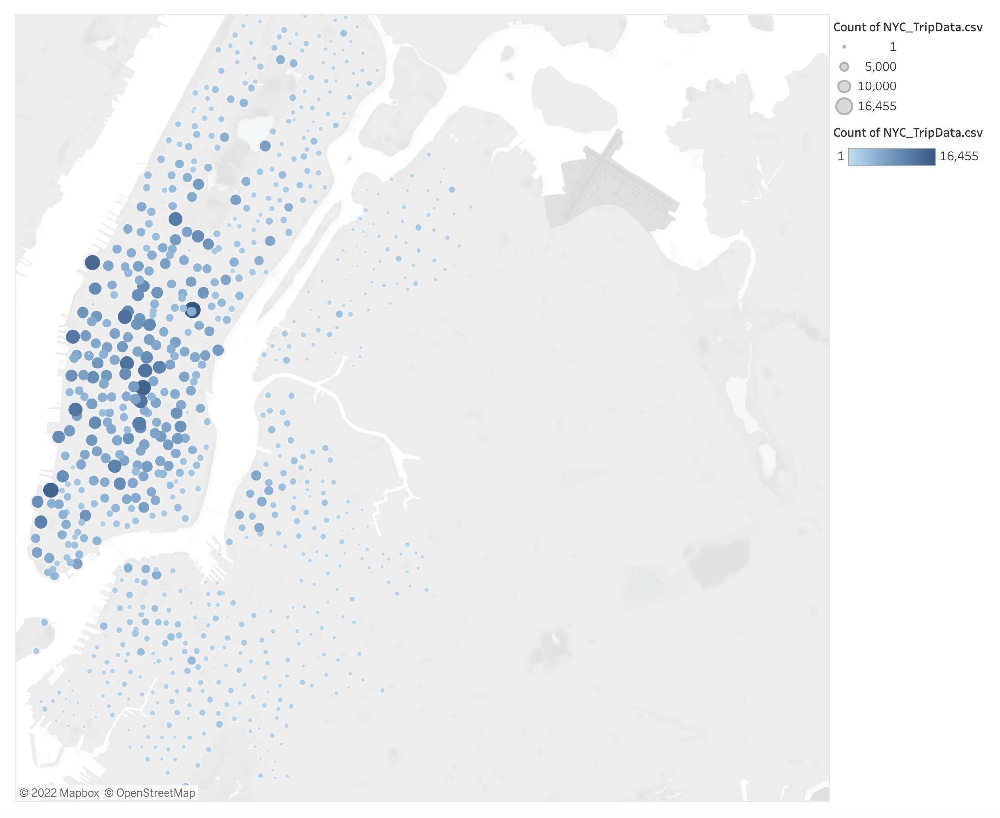

#  NYC Trip Data 

## Overview of the analysis:
We are looking to explore what is the driving force behind a bike share business in New York City to understand if it is a viable business for Des Moines, Iowa.

I will use pandas to update a csv file with New York Citibike data. The I will use Tableau to create Data Visualizations that are easy to understand. The goal of the visualizations is to show the following:

* The length of time that bikes are checked out for all riders and genders
* The number of bike trips for all riders and genders for each hour of each day of the week
* The number of bike trips for each type of user and gender for each day of the week.

[link to dashboard](https://public.tableau.com/app/profile/paul.lymburner5062/viz/NYCTripDataChallenge_16696081895920/NYCTripDataChallenge#1 "link to dashboard")

## Results:
In this visualization, we see  the length of time that bikes are checked out for all riders.
 *  The trip duration for most users was under 1 hour.  (Most users trip duration was 5 minutes)
 

In this visualization, we see  the length of time that bikes are checked out for each gender.
 *  Most males trip duration was 5 minutes while most females trip duration was 6 minutes
 

In this visualization, we see the number of bike trips by weekday for each hour of the day as a heatmap.
 *  Thursdays at 5 and 6 PM were the most popular time for Citibike users
 

In this visualization, we see the number of bike trips by gender for each hour of each day of the week as a heatmap.
 *  Thursdays were the most popular day for both Male and Female Citibike users
 
   
In this visualization, we have a heatmap that shows the number of bike trips broken down by gender for each day of the week by each Usertype.
 *  Most users are male's with the usertype "Subscriber"
 

This pie chart gives the breakdown of rider types in New York City, which will help us predict the customer breakdown in Des Moines
 *  81% of users are Subscribers, 19% are Customers
 

This map shows the Top Bike Stations in the City for Starting a Journey
 

## Summary:
We were able to identify the peak hours (5 & 6PM) as well as the busiest day (Thursday) for Citibike users in New York City.  We also identified that males are the most popular segment.  We have gathered some useful information however more analysis is needed.  It would be helpful to understand demographic information of New York City vs Des Moines, Iowa.

### Additional visualizations that I would like to perform with the dataset
* Examine the relationship between the trip duration and the start location
* Examine the relationship between age and usertype
